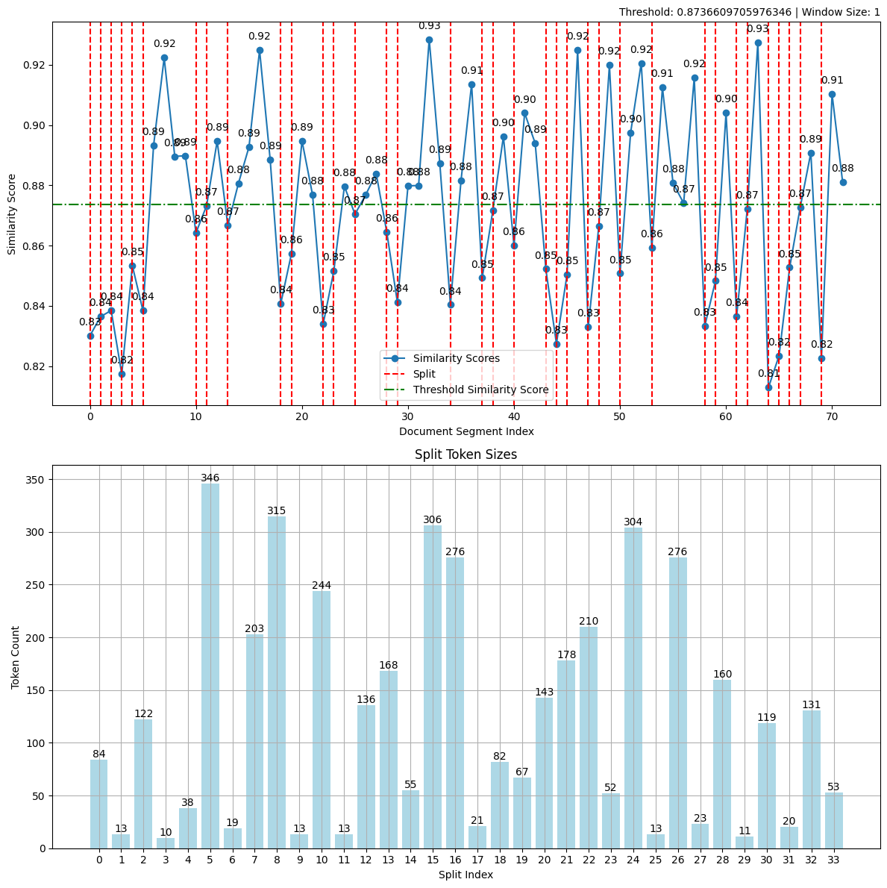

# SKCC_LCL
## Bonito and Split repository

### 1. Bonito
Bonito는 unannotated text를 task별 training dataset으로 변환하여 instruction을 튜닝하는 open-source 모델입니다. 이 모델을 이용해, raw corpus로 다양한 task의 instruction / input / output의 데이터를 생성할 수 있습니다.

본 내용의 paper 및 code의 출처는 다음과 같습니다.
- Paper: [Learning to Generate Instruction Tuning Datasets for
Zero-Shot Task Adaptation](https://arxiv.org/abs/2402.18334)
- Model: [bonito-v1](https://huggingface.co/BatsResearch/bonito-v1)
- Dataset: [ctga-v1](https://huggingface.co/datasets/BatsResearch/ctga-v1)
- Code: To reproduce experiments in our paper, see [nayak-arxiv24-code](https://github.com/BatsResearch/nayak-arxiv24-code).

본 LCL 활동을 통해 해당 pipeline code를 한국어 raw corpus에 동작하도록 수정하였으며(output은 번역이 필요할 수 있음), 한국어 raw corpus가 input으로 들어갔을 때, 다음 16가지 task의 dataset을 구축할 수 있습니다.
1. exqa ("extractive question answering")
2. mcqa ("multiple-choice question answering")
3. qg ("question generation")
4. qa ("question answering without choices")
5. ynqa ("yes-no question-answering")
6. coref ("coreference resolution")
7. paraphrase ("paraphrase generation")
8. paraphrase_id ("paraphrase identification")
9. sent_comp ("sentence completion")
10. sentiment ("sentiment")
11. summarization ("summarization")
12. text_gen ("text generation")
13. topic_class ("topic classification")
14. wsd ("word sense disambiguation")
15. te ("textual entailment")
16. nli ("natural language inference")

다음 경로의 코드: bonito/testing.py는 mistral-7B로 이미 학습되어 있는 모델을 사용하여, 몇 가지 dataset을 만드는 예제가 들어있는 파일입니다. 이를 참고 및 응용하여 여러가지 dataset을 추가적으로 구축할 수 있습니다.

### 2. Split Module
많은 LLM tasks에서 input의 길이는 모델 성능의 제약을 불러옵니다. 따라서 긴 text(ex: document, corpus...)를 다루기 위해서, split 및 chunking 과정이 필요합니다. 
본 LCL 과정에서는 semantic_router의 RollingWindowSplitter와 FastEmbedEncoder(intfloat/multilingual-e5-large)를 이용하여, 들어오는 document를 splitting & chunking 하였습니다. 현재 사용하는 e5-large Encoder 모델은 2.0GB로, 현재 등장하고 있는 LLM의 semantic 이해능력을 따라갈 수는 없으나, 대량의 document를 처리해야하는 상황에서 유용하게 사용됩니다.

다음 경로의 코드: splitter/splitter.py는 특정 예제 document(SKT 관련)를 splitting & chunking하는 예제입니다. input 및 output 결과의 일 부분은 다음과 같습니다.
- input : 
    
    제1조(목적)
    이 약관은 SK텔레콤(이하 "회사") '내가고른패키지'(이하 "패키지") 상품 가입, 이용 및 해지에 관한 기본적인 사항을 정함을 목적으로 합니다.

    제2조(약관의 적용)
    회사의 패키지 상품을 이용할 때에는 이 약관과 함께 회사 및 각 상품별 제휴사 이용약관(이하 "개별약관")을 적용합니다. 단, 이 약관, 개별약관 사이에 상충되는 내용이 있는 경우, 이 약관, 개별약관의 순으로 적용합니다.

    제3조(용어의 정의)
    개별 약관에서 정의한 용어 이외 이 약관에서 사용하는 용어의 정의는 다음과 같습니다.

    ① 패키지 상품 : '내가고른패키지' 출시(2018. 10. 18.) 이후 회사 및 회사의 대리점·판매점을 통하여 회사에서 지정한 상품을 2개 이상 가입하여 이용하는 상품으로 고객의 자율 의사에 따라 선택이 가능함
    ② 제휴사 : 패키지 상품을 이용하는 고객에게 요금할인 등 패키지 혜택을 제공하는 사업자
    ③ 패키지 혜택 : 회사 또는 제휴사가 패키지 상품 이용기간 동안 이용자에게 제공하는 요금할인 또는 기타 모든 경제적인 이익 및 이용 편의
    ④ 메인 상품 : 패키지 혜택을 받기 위해 회사가 지정한 상품 중 1개 이상 반드시 선택해야 하는 상품
    ⑤ 제휴 상품 : 패키지 상품에 포함되는 상품으로서 SK텔레콤 이동전화를 이용하는 경우에만 가입이 가능한 상품
    제4조(패키지 상품 이용조건)
    ...

- output :

    [제1조(목적)
    이 약관은 SK텔레콤(이하 "회사") '내가고른패키지'(이하 "패키지") 상품 가입, 이용 및 해지에 관한 기본적인 사항을 정함을 목적으로 합니다.,
    
    제2조(약관의 적용),

    회사의 패키지 상품을 이용할 때에는 이 약관과 함께 회사 및 각 상품별 제휴사 이용약관(이하 "개별약관")을 적용합니다. 단, 이 약관, 개별약관 사이에 상충되는 내용이 있는 경우, 이 약관, 개별약관의 순으로 적용합니다.,

    제3조(용어의 정의),

    개별 약관에서 정의한 용어 이외 이 약관에서 사용하는 용어의 정의는 다음과 같습니다.,

    ① 패키지 상품 : '내가고른패키지' 출시(2018. 10. 18.) 이후 회사 및 회사의 대리점·판매점을 통하여 회사에서 지정한 상품을 2개 이상 가입하여 이용하는 상품으로 고객의 자율 의사에 따라 선택이 가능함
    ② 제휴사 : 패키지 상품을 이용하는 고객에게 요금할인 등 패키지 혜택을 제공하는 사업자
    ③ 패키지 혜택 : 회사 또는 제휴사가 패키지 상품 이용기간 동안 이용자에게 제공하는 요금할인 또는 기타 모든 경제적인 이익 및 이용 편의
    ④ 메인 상품 : 패키지 혜택을 받기 위해 회사가 지정한 상품 중 1개 이상 반드시 선택해야 하는 상품
    ⑤ 제휴 상품 : 패키지 상품에 포함되는 상품으로서 SK텔레콤 이동전화를 이용하는 경우에만 가입이 가능한 상품,

    제4조(패키지 상품 이용조건),
    ...]

해당 output을 도출하는 과정에서 다음의 그림처럼 시각화된 그림도 확인할 수 있습니다.

