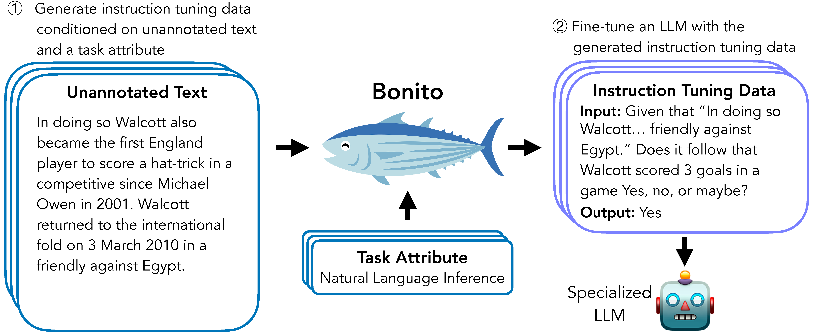

# SKCC_LCL
## Bonito and Split repository

### 1. Bonito
Bonito는 unannotated text를 task별 training dataset으로 변환하여 instruction을 튜닝하는 open-source 모델입니다. 이 모델을 이용해, raw corpus로 다양한 task의 instruction / input / output의 데이터를 생성할 수 있습니다.

본 내용의 paper 및 code의 출처는 다음과 같습니다.
- Paper: [Learning to Generate Instruction Tuning Datasets for
Zero-Shot Task Adaptation](https://arxiv.org/abs/2402.18334)
- Model: [bonito-v1](https://huggingface.co/BatsResearch/bonito-v1)
- Dataset: [ctga-v1](https://huggingface.co/datasets/BatsResearch/ctga-v1)
- Code: To reproduce experiments in our paper, see [nayak-arxiv24-code](https://github.com/BatsResearch/nayak-arxiv24-code).

본 LCL 활동을 통해 해당 pipeline code를 한국어 raw corpus에 동작하도록 수정하였으며(output은 번역이 필요할 수 있음), 한국어 raw corpus가 input으로 들어갔을 때, 다음 16가지 task의 dataset을 구축할 수 있습니다.
1. exqa ("extractive question answering")
2. mcqa ("multiple-choice question answering")
3. qg ("question generation")
4. qa ("question answering without choices")
5. ynqa ("yes-no question-answering")
6. coref ("coreference resolution")
7. paraphrase ("paraphrase generation")
8. paraphrase_id ("paraphrase identification")
9. sent_comp ("sentence completion")
10. sentiment ("sentiment")
11. summarization ("summarization")
12. text_gen ("text generation")
13. topic_class ("topic classification")
14. wsd ("word sense disambiguation")
15. te ("textual entailment")
16. nli ("natural language inference")

다음의 directory: bonito/testing.py는 mistral-7B로 이미 학습되어 있는 모델을 사용하여, 몇 가지 dataset을 만드는 예제가 들어있는 파일입니다. 이를 참고 및 응용하여 여러가지 dataset을 추가적으로 구축할 수 있습니다.

### 2. Split