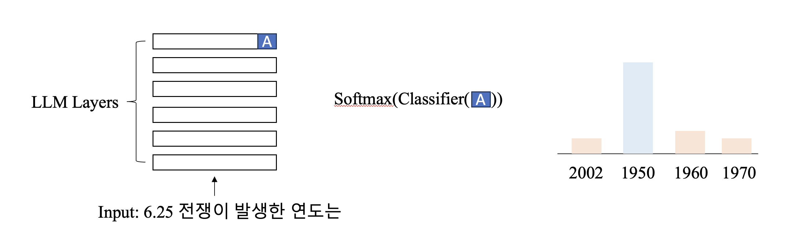
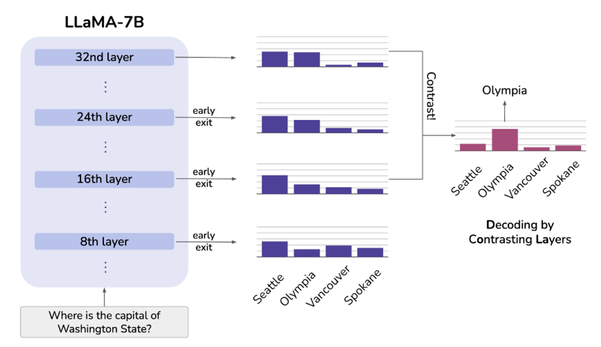
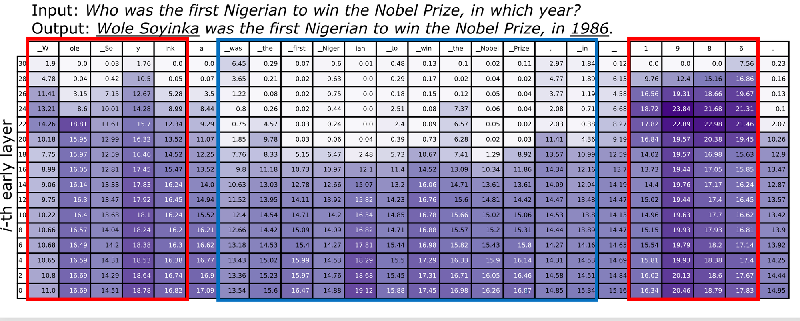

# SKCC_LCL
# DoLa : Decoding by Contrasting Layers Improves Factuality in Large Language Models

<aside>
💡 LLM의 환각을 줄이기 위한 새로운 디코딩 전략

</aside>

# Introduction

- LLM의 환각
    
    LLM은 **사전 학습에서 관찰된 실제 사실에서 벗어난 내용을 생성**하는 “환각”을 일으키는 경향이 있음. 
    
    환각의 이유는 명확하지 않으나, 데이터와 언어모델의 확률 분포 간 차이(KL-divergence)를 줄이고자 학습하는 **language modeling objective** 가 원인이 될 수 있음. 즉, 언어 모델은 학습된 코퍼스에서 실제 사실을 인식하는 대신에 외부 패턴을 인식하며 학습됨. 
    
- 모델 해석 관점
    
    
    
    이전 연구에서 LM의 하위 레이어는 lower-level information(은,는,이,가,한,…)을, 상위 레이어는 semantic information(6.25전쟁, 발생, 연도,…)을 인코딩하는 것으로 나타남. 
    
    또한 LM 내에서 특정 feed-forward layer를 변형하여 사실적 지식을 편집할 수 있음을 보여줌. 
    

# DoLa


위 그림에서 LM은 마지막 layer에서 높은 확률을 가지는 Seattle을 output으로 뱉게 됨. 

실제 정답(Olympia)은 상위 레이어 일수록 확률이 증가해야되는데, 하위 레이어에서부터 확률이 높았던 것으로 인하여 환각이 발생됨. 

→ 서로 다른 레이어 간의 확률 분포를 대조하여 이를 교정하면 환각을 줄일 수 있지 않을까?



위 그림은 마지막 레이어와 이전 레이어들의 JSD(Jenson-Shannon divergence)를 계산한 것임. JSD가 작을 수록 마지막 레이어의 분포와 차이가 적다는 의미를 지님. 

1) JSD가 중요한 엔티티의 상위 레이어에서 여전히 높음. → 이는 마지막 레이어와 차이가 큰 것을 의미하고 예측을 변경할 수 있다는 사실을 의미함.

2) 쉬운 토큰을 예측할 때 중간 레이어에서 매우 작아짐. → 모델이 중간 레이어에서 생성할 토큰을 이미 결정했으며 출력 분포를 거의 변경하지 않고 유지함. 

→ 레이어의 JSD가 갑자기 변할 때를 대조하면(contrastive decoding), LM의 실제 사실을 증폭시켜 사실적 지식을 효과적으로 사용하고 잘못된 사실을 생성하는 환각 현상을 해소할 수 있을 것임!

이러한 접근 방식은 추가적인 1) 외부지식이 필요하지 않고 2) 어떠한 파인 튜닝도 하지 않아도 된다는 장점을 가짐.


# Method

(1) transformer 의 마지막 layer와 다른 layer 간의 JSD를 계산하여 분포가 가장 크게 변화하는 레이어를 찾음. 

(2) (1)에서 찾은 layer의 logit과 원래 transformer 마지막 layer의 logit을 비교하여, 최종 logit을 교정함. 

- 코드
    
    ```python
    # 1. Stacking all premature_layers into a new dimension
    stacked_premature_layers = torch.stack(
        [candidate_premature_logits[i].to(final_logits) for i in candidate_premature_layers], dim=0
    )
    # 2. Calculate the softmax values for mature_layer and all premature_layers
    softmax_mature_layer = F.softmax(final_logits, dim=-1).detach() # shape: (batch_size, vocab_size)
    softmax_premature_layers = F.softmax(
        stacked_premature_layers, dim=-1
    )  # shape: (num_premature_layers, batch_size, vocab_size)
    
    # 3. Calculate M, the average distribution
    M = 0.5 * (
        softmax_mature_layer[None, :, :] + softmax_premature_layers
    )  # shape: (num_premature_layers, batch_size, vocab_size)
    
    # 4. Calculate log-softmax for the KL divergence
    log_softmax_mature_layer = F.log_softmax(final_logits, dim=-1)  # shape: (batch_size, vocab_size)
    log_softmax_premature_layers = F.log_softmax(
        stacked_premature_layers, dim=-1
    )  # shape: (num_premature_layers, batch_size, vocab_size)
    
    # 5. Calculate the KL divergences and then the JS divergences
    kl1 = F.kl_div(log_softmax_mature_layer[None, :, :], M, reduction="none").mean(
        -1
    )  # shape: (num_premature_layers, batch_size)
    kl2 = F.kl_div(log_softmax_premature_layers, M, reduction="none").mean(
        -1
    )  # shape: (num_premature_layers, batch_size)
    js_divs = 0.5 * (kl1 + kl2)  # shape: (num_premature_layers, batch_size)
    # 6. Reduce the batchmean
    js_divs = js_divs.mean(-1)  # shape: (num_premature_layers,)
    
    premature_layer = candidate_premature_layers[int(js_divs.argmax().cpu().item())]
    base_logits = candidate_premature_logits[premature_layer]
    final_logits, base_logits = _relative_top_filter(final_logits.detach(), base_logits.detach())
    logits = final_logits - base_logits.to(final_logits.device)
    ```
    
    ```python
    def _relative_top_filter(
        scores: torch.FloatTensor,
        baseline_scores: torch.FloatTensor,
        relative_top: float = 0.1,
        filter_value: float = -float("Inf"),
        base_filter_value=-1e-3,
        min_tokens_to_keep: int = 1,
    ) -> torch.FloatTensor:
    
        scores_normalized = scores.log_softmax(dim=-1)
        baseline_scores_normalized = baseline_scores.log_softmax(dim=-1)
        sorted_logits, sorted_indices = torch.sort(scores_normalized, descending=True)
        min_thresh = sorted_logits[..., min_tokens_to_keep - 1]
        probs_max = torch.max(scores_normalized, dim=-1).values # 실제 정답 logit
        probs_thresh = probs_max + np.log(relative_top) # 실제 정답 logit에 어떤 값 더한 것. 
        probs_thresh = torch.min(min_thresh, probs_thresh) 
        probs_thresh = probs_thresh.unsqueeze(-1)
        baseline_scores_normalized[scores_normalized < probs_thresh] = base_filter_value
        scores_normalized[scores_normalized < probs_thresh] = filter_value
        return scores_normalized, baseline_scores_normalized
    
    ```